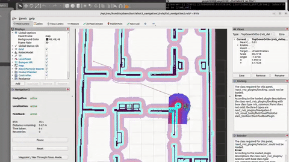

<p align="left">


</p>
# TurtleBot3 Path Planning Demo

**Repository Link:** [https://github.com/yayabash/turtlebot3_path_planning](https://github.com/yayabash/turtlebot3_path_planning)

This project demonstrates robust path planning for TurtleBot3 in simulation using the **A* (A-Star)** and **DWA (Dynamic Window Approach)** algorithms. The demo uses ROS 2 Humble and Gazebo, featuring dynamic obstacle avoidance testing and quantitative analysis.

## Video Demonstration
Video demonstration comming soon.

## Features

- **Global Planner (A\*)**: Optimal path planning on a static costmap.
- **Local Planner (DWA)**: Reactive collision avoidance and trajectory generation.
- **Dynamic Scenarios**: Custom scripts to spawn obstacles in real-time to test robot reflexes.
- **Analysis Tools**: Automated Python scripts to log metrics (time/distance) and plot trajectories.
- **Academic Report**: Includes LaTeX source for a report detailing the methodology and results.
- **Custom Configuration**: Tuned Nav2 parameters (`waffle_astar.yaml`) for precise navigation.

## Requirements

- **Ubuntu**: 22.04 LTS
- **ROS 2**: Humble Hawksbill
- **Python**: 3.10+
- **Gazebo**: Classic (11)
- **Dependencies**:
```bash
sudo apt install ros-humble-turtlebot3-gazebo \
                     ros-humble-turtlebot3-navigation2 \
                     ros-humble-nav2-simple-commander \
                     python3-matplotlib
```

## Structure

```
turtlebot3_path_planning/
├── maps/                   # Custom occupancy grid maps
├── turtlebot3_gazebo/      # Launch files, worlds, and spawn scripts
│   ├── scripts/            # Helper scripts (spawn_box.py, etc.)
│   ├── models/             # Custom models
│   └── launch/             # Simulation launch files
├── turtlebot3_navigation2/ # Navigation config
│   ├── param/              # Tuned waffle_astar.yaml
│   └── launch/             # Navigation launch wrapper
├── analysis/               # Results (Plots & CSVs) from test runs
├── turtlebot3_project-1             # the project report pdf
└── run_analysis.py         # Automated test runner script
```

## Usage

### 1. Build
```bash
cd ~/turtlebot3_ws
colcon build --symlink-install
source install/setup.bash
```

### 2. Launch Simulation (Terminal 1)
```bash
export TURTLEBOT3_MODEL=waffle
ros2 launch turtlebot3_gazebo turtlebot3_my_world.launch.py
```

### 3. Launch Navigation (Terminal 2)
```bash
export TURTLEBOT3_MODEL=waffle
ros2 launch turtlebot3_navigation2 my_navigation_astar.launch.py map:=src/turtlebot3_path_planning/maps/custom_map.yaml use_sim_time:=true
```

### 4. Run Analysis & Tests (Terminal 3)
To run the automated static vs. dynamic obstacle test suite:
```bash
# Ensure you are in the workspace root
python3 src/turtlebot3_path_planning/run_analysis.py
```
This script will:
*   Navigate the robot from Start to Goal.
*   Log position and velocity data.
*   Repeat the test, but spawn a dynamic obstacle mid-path.
*   Save trajectory plots to `analysis/` folder.

## Video Demonstration

This sped-up preview shows the robot navigating through the custom environment and avoiding obstacles.

[](turtlebot3_demo.mp4)

[**Click here to watch the full 44s Demo Video (MP4)**](turtlebot3_demo.mp4)

## Results
The project successfully demonstrates that while A* provides optimal global paths, the DWA controller is essential for handling unmapped dynamic obstacles. Our analysis shows a trade-off: avoiding obstacles dynamically increases path length but ensures safety without stopping, whereas complete blockages trigger global replanning which preserves path length but significantly increases travel time.
